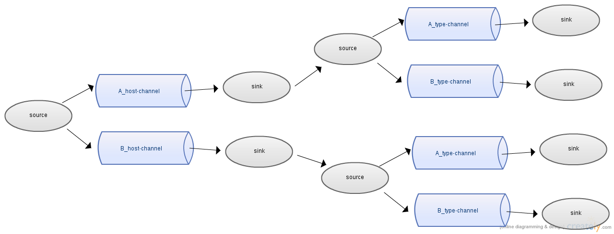

flume-ng router sinks
=========

Extends flume-ng sinks to router-like sinks, which can route events according to specific header of event.

  - AvroRouterSink
  - MailRouterSink

Compatible with flume 1.4.0, 1.5.0, 1.5.0.1.

Why router sinks
----

[Flume Channel Selectors](<http://flume.apache.org/FlumeUserGuide.html#flume-channel-selectors>) has already provided such router-like function. Why do we need such function on sink?

In our circumstance, we need to create flat structure for implementing events separating function as soon as events ingested to flume sources. If we use channel selector only, the flume topology would be constricted into limited servers. For example, event has two type of headers as below:

Header   | Value
-------- | ---
host     | {A_host, B_host}
type     | {A_type, B_type}

##### Event in JSON format
```
{
  "header": {
        "host": "A_host",
        "type": "B_type"
  },
  "Body": "event body"
}

```

We need to spill events to 4 different external repositories. To this end, we have to deploy three chained agents on one server by channel selector. It won't be big problem when event flow has low pressure. But, it will consume too much resources(memory, net I/O) when flow faces high pressure. More precisely, the flow pressure would be doubled since we have three agents.



Now, instead of using chained agents of channel selector, we can use one agent (channel selector with router sink) to solve this problem. RouterSink makes your flume topology more simple and slim.


Configurations
--------------

##### AvroRouterSink configuration:
```
agent.sinks.routerSink.type = com.datums.stream.AvroRouterSink
agent.sinks.routerSink.hostname = test_host
agent.sinks.routerSink.port = 34541
agent.sinks.routerSink.channel = memoryChannel

# Set sink name
agent.sinks.routerSink.component.name = AvroRouterSink

# Set header name for routing
agent.sinks.routerSink.condition = origin

# Set routing conditions
agent.sinks.routerSink.conditions = test
agent.sinks.routerSink.conditions.test.if = ^A*
agent.sinks.routerSink.conditions.test.then.hostname = test_host
agent.sinks.routerSink.conditions.test.then.port = 34542

```

##### MailRouterSink configuration:
```
agent.sinks.routerSink.type = com.datums.stream.MailRouterSink
agent.sinks.routerSink.hostname = mail_server
agent.sinks.routerSink.port = 25
agent.sinks.routerSink.channel = memoryChannel

# Set mail function
agent.sinks.routerSink.sender = steve@test.com
agent.sinks.routerSink.recipient = default@test.com
agent.sinks.routerSink.subject = Test
agent.sinks.routerSink.message = TestBody

# pooling.duration needs second as unit, this will pool event in 30 seconds
agent.sinks.routerSink.pooling.duration = 30
agent.sinks.routerSink.pooling.batch = 10

# Set sink name
agent.sinks.routerSink.component.name = MailRouterSink

# Set header name for routing
agent.sinks.routerSink.condition = origin

# Set routing conditions
agent.sinks.routerSink.conditions = test
agent.sinks.routerSink.conditions.test.if = ^A*
agent.sinks.routerSink.conditions.test.then = aaa@test.com
```
